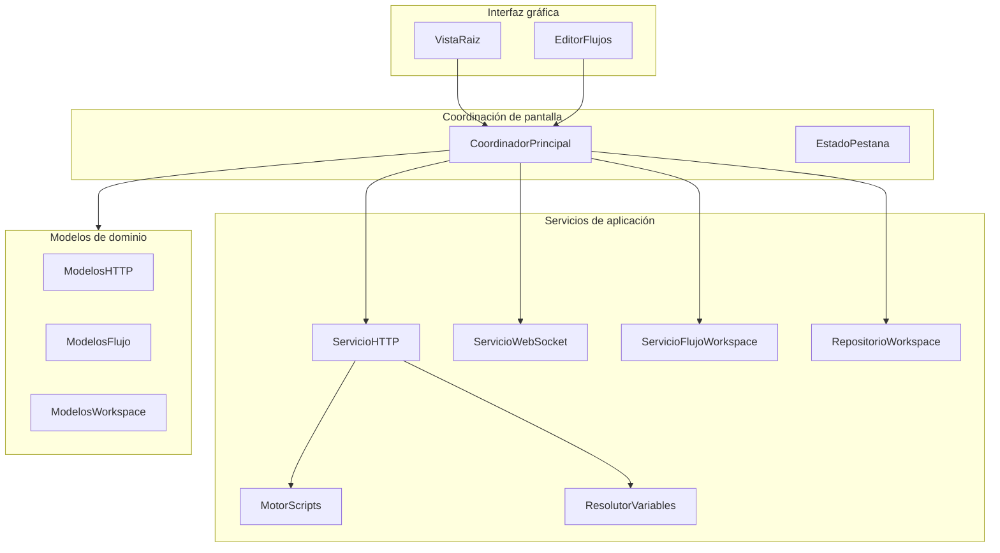

# Arquitectura

## Comenzar desde cero

1. Entiende el **workspace** como unidad central: colecciones, peticiones, entornos y flujos viven en un solo estado coherente.
2. Separa mentalmente **tres capas**: interfaz de usuario → coordinador de pantalla (view model) → servicios de aplicación y modelos de dominio.
3. Para una **petición HTTP**, sigue el camino: edición en pestaña → coordinador → servicio de ejecución → red → resultado mostrado en la misma pestaña.
4. Para **WebSockets**, localiza el servicio dedicado y el estado de pestaña asociado (transcript, conexión, tareas cancelables).
5. Para **flujos BPMN**, identifica validación, interpretación del grafo y servicio de ejecución que emite logs y estado para el diagrama.
6. Para **Postman/OpenAPI**, trata la interoperabilidad como capa de importación/exportación que traduce formatos externos al modelo interno del workspace.
7. Para **persistencia**, el workspace se serializa a disco como JSON con versión de esquema y migraciones; detalle en [modelo-datos-y-persistencia.md](reference/modelo-datos-y-persistencia.md).

## Vista general

La app presenta un workspace cargado en memoria y persistido mediante servicios de aplicación. La interfaz observa un coordinador principal que enlaza pestañas de petición, colecciones, entornos y el editor de flujos.

## Flujo de una petición HTTP

1. El usuario edita una petición en una pestaña (estado de pestaña).
2. El coordinador delega en el servicio de ejecución la resolución de variables y los scripts previos al envío.
3. Se construye la petición real con la API de red del sistema, aplicando políticas TLS que el producto exponga para laboratorios.
4. El resultado se refleja en modelo de respuesta, trazas legibles y consola de la pestaña.

## Flujos BPMN

El motor de flujos interpreta las definiciones del workspace (ramas, paralelismo, temporizadores, gateways). El estado de ejecución vuelve al coordinador para resaltar nodos en el diagrama.

## Interoperabilidad Postman

Los códecs de colección y entorno traducen formatos compatibles con Postman hacia el modelo interno y a la inversa, sin acoplar la UI a detalles del formato externo.

## Referencia técnica ampliada

Para implementar desde cero o auditar un módulo concreto, usa los documentos en [reference/](reference/): paquete SPM, modelo de datos, runtime de peticiones/scripts, flujos BPMN, integraciones e interfaz.

## Tile Tessl

El manifiesto en la carpeta del tile apunta a esta documentación. Los requisitos detallados por área están en la carpeta de especificaciones del mismo árbol `SDD`.
