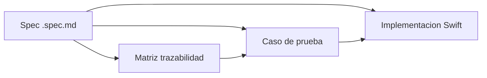

# Metodología SDD (Specification-Driven Development)

## Definición

El desarrollo guiado por especificaciones prioriza definir **qué** debe hacer el sistema (requisitos verificables) antes de implementar **cómo**. En este proyecto, las specs son la fuente de verdad funcional.

## Artefactos SDD



| Capa | Ubicación | Rol |
|------|-----------|-----|
| Especificaciones | `SDD/tile/specs/*.spec.md` | Requisitos por área funcional |
| Referencia técnica | `SDD/tile/docs/reference/` | Contratos de implementación |
| Reglas | `SDD/tile/rules/` | Proceso, seguridad, checklist |
| Trazabilidad | `docs/traceability-matrix.md` | Enlace spec → REQ-ID → test |

## Las 10 especificaciones

| Spec | Área |
|------|------|
| `http-request-execution.spec.md` | Pipeline HTTP completo |
| `variable-resolution.spec.md` | Precedencia de variables |
| `javascript-pm-runtime.spec.md` | Runtime `pm.*` y criptografía |
| `javascript-tooling.spec.md` | Editor, autocompletado, formato |
| `websocket-client.spec.md` | Cliente WebSocket |
| `workspace-flow.spec.md` | Flujos BPMN |
| `postman-interop.spec.md` | Import/export Postman |
| `git-workspace.spec.md` | Operaciones Git |
| `persistencia-workspace.spec.md` | Persistencia JSON y migraciones |
| `main-view-model-workspace.spec.md` | Coordinador de workspace |

## Flujo de trabajo SDD

1. **Identificar área** — nueva capacidad o bugfix en una viñeta de [funcionalidades-requeridas.md](../../SDD/tile/rules/funcionalidades-requeridas.md).
2. **Leer o ampliar spec** — abrir el `.spec.md` correspondiente; añadir requisito con criterio de verificación.
3. **Asignar ID** — formato `REQ-<AREA>-<NNN>` (ej. `REQ-HTTP-001`).
4. **Implementar** — código en targets SPM respetando capas Domain → Application → Infrastructure → Presentation.
5. **Verificar** — test automatizado o checklist manual descrito en la spec.
6. **Actualizar trazabilidad** — fila en `traceability-matrix.md` y sección `## Trazabilidad` en la spec.

## Formato de una spec

Cada `.spec.md` incluye:

- **Frontmatter Tessl**: `name`, `description`, `targets` (ámbitos lógicos).
- **Comenzar desde cero**: pasos para implementar el módulo.
- **Comportamiento**: requisitos con criterio de verificación.
- **Trazabilidad**: IDs `REQ-*` y nombres lógicos de casos de prueba.

## Integración con Tessl

El tile `efbyproyectos/efby-request-lab` en `SDD/tile/tile.json` empaqueta docs, rules y specs para agentes IA. Comandos:

```bash
tessl tile lint ./SDD/tile
tessl tile publish ./SDD/tile --workspace TU_WORKSPACE
```

## Criterio de completitud SDD

- Las 10 specs tienen sección de trazabilidad con IDs.
- La matriz en `docs/traceability-matrix.md` cubre ≥ 80 % de requisitos con test automatizado.
- Cada cambio de contrato observable actualiza la spec antes del merge.
