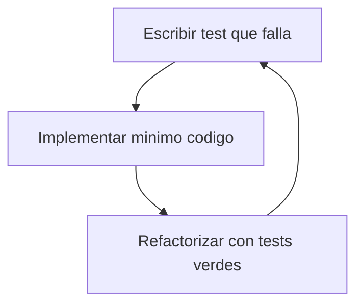

# Metodología TDD (Test-Driven Development)

## Definición

TDD aplica el ciclo **Red → Green → Refactor**: escribir un test que falle, implementar el mínimo para que pase, refactorizar manteniendo tests verdes.

## Ciclo aplicado en EFBY Request Lab

## Convenciones de nombres

| Patrón | Ejemplo | Uso |
|--------|---------|-----|
| `test<Comportamiento>()` | `testResolvesEnvironmentOverCollection()` | Caso unitario XCTest |
| `REQ-<AREA>-<NNN>` | `REQ-PERS-002` | ID en spec y matriz |
| Suite por servicio | `RequestExecutionServiceTests` | Agrupa tests de un componente |

## Ubicación de tests

- **Target**: `AppCoreTests` (depende de `EfbyPresentation` en `Package.swift`).
- **Comando**: `swift test` desde la raíz del repositorio.
- **Principio**: tests deterministas; red simulada con `URLProtocol` registrado, sin APIs públicas inestables.

## Estrategia por capa

| Capa | Enfoque TDD |
|------|-------------|
| Domain | Tests de modelos puros, codificación/decodificación |
| Application | Tests de servicios con dependencias inyectadas o mocks |
| Infrastructure | Tests de repositorios con directorios temporales |
| Presentation | Tests de ViewModel con servicios fake (sin SwiftUI) |
| UI (SwiftUI) | Checklist manual; smoke tests futuros |

## Tests existentes (~115+ casos)

| Suite | Área cubierta |
|-------|---------------|
| `RequestExecutionServiceTests` | HTTP, scripts, mutaciones |
| `VariableResolverTests` | Precedencia de variables |
| `PostmanCollectionCodecTests` | Import/export Postman |
| `GitRepositoryServiceTests` | Operaciones Git |
| `WebSocketExecutionServiceTests` | WebSocket |
| `WorkspaceFlow*Tests` | BPMN, gateways, ejecución |
| `JavaScript*Tests` | Tooling del editor |
| `MainViewModel*Tests` | Coordinador y entornos |

## Suites añadidas recientemente

| Suite nueva | Área |
|-------------|------|
| `OpenAPIImporterTests` | Importación OpenAPI 3.x |
| `WorkspaceRepositoryTests` | Persistencia y migración |
| `SharedCollectionsRepositoryTests` | Colecciones compartidas Git |
| `ScriptEngineTests` | Runtime `pm` aislado |

## CI/CD

GitHub Actions ejecuta `swift build` y `swift test` en cada push/PR a `main` (workflow `.github/workflows/ci.yml`).

## Trazabilidad spec ↔ test

Cada requisito en una spec tiene:

1. ID `REQ-*` en la sección `## Trazabilidad`.
2. Nombre lógico del caso de prueba (sin rutas de código).
3. Entrada en `docs/traceability-matrix.md` con estado: Automatizado / Manual / Pendiente.

## Criterio de completitud TDD

- `swift test` pasa en local y en CI.
- Matriz de trazabilidad con ≥ 80 % de requisitos verificados por test automatizado.
- Gaps críticos (persistencia, OpenAPI, ScriptEngine) cubiertos con suites dedicadas.
